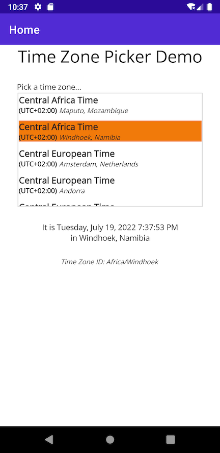
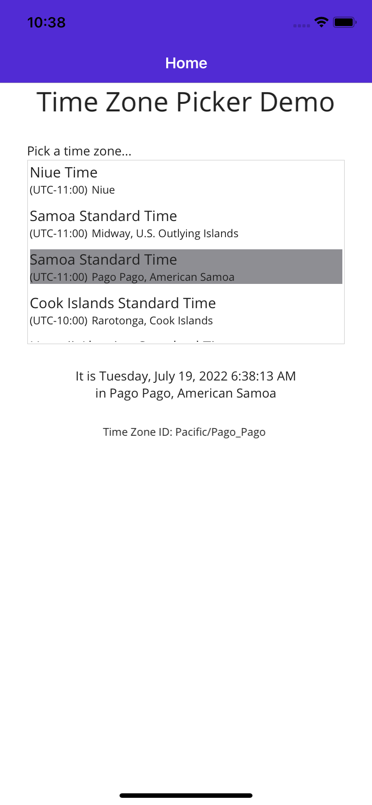
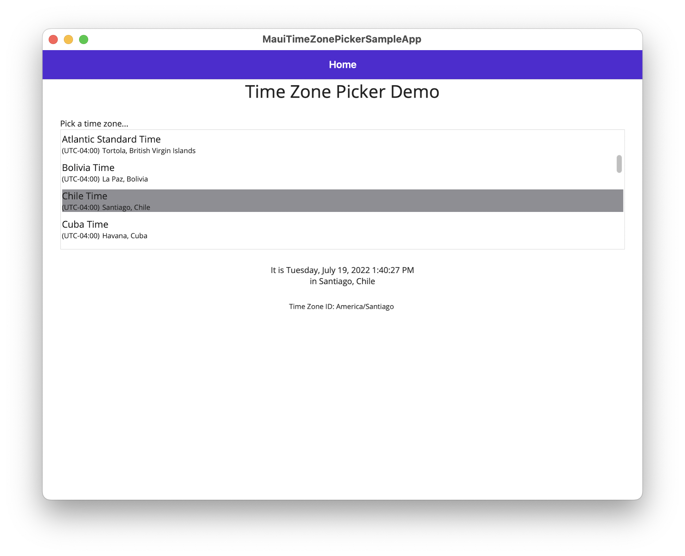
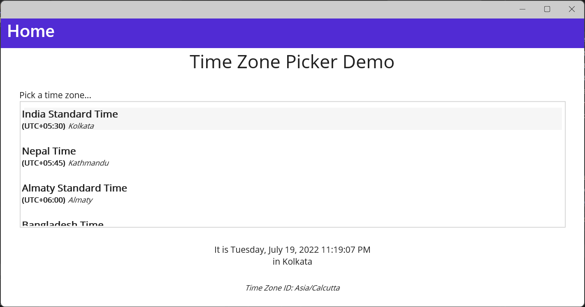

# MauiTimeZonePicker
Time Zone Picker control for .NET MAUI

[](https://www.nuget.org/packages/mjp.MauiTimeZonePicker)
[](https://github.com/mattjohnsonpint/MauiTimeZonePicker/blob/main/LICENSE)

Read all about it:
https://blog.sentry.io/2022/07/19/making-a-time-zone-picker-control-for-net-maui

## Installation

```shell
dotnet add package mjp.MauiTimeZonePicker --prerelease
```

## Example Usage

- In your XAML where you want to use the control, add the namespace:

    ```
    xmlns:mtzp="clr-namespace:MauiTimeZonePicker;assembly=MauiTimeZonePicker"
    ```

- Then add the control.  Give the instance a name if desired.  Bind to the `SelectedItemChanged` event to respond to selection changes.
    ```xml
    <mtzp:TimeZonePicker
        x:Name="TimeZonePicker"
        SelectedItemChanged="TimeZoneChanged" />
    ```

Review the application in the [/sample](sample) directory for futher details. 

## Screenshots

### Android


### iOS


### macOS (Mac Catalyst)


### Windows

